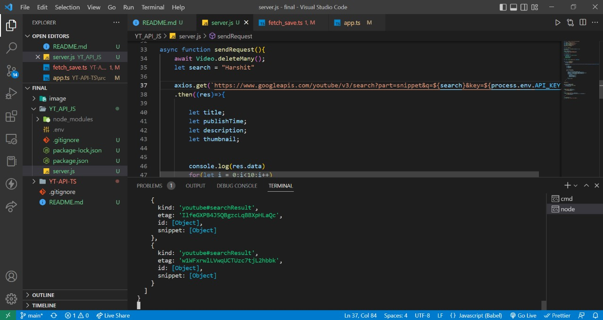
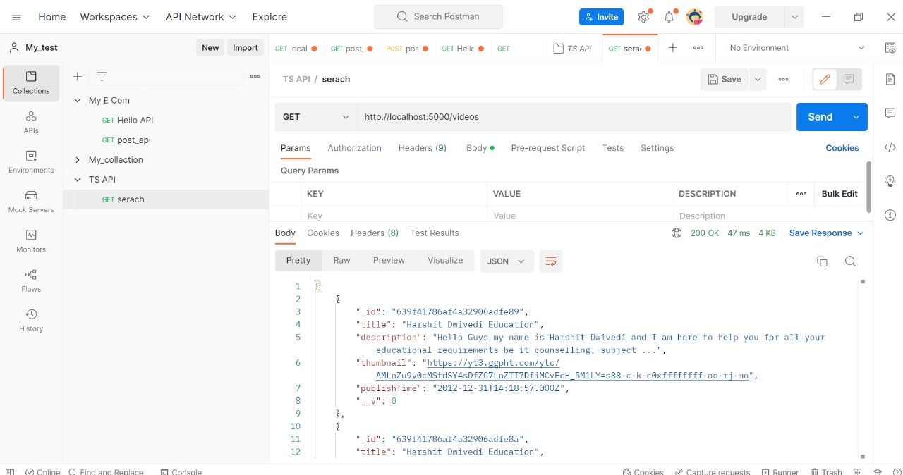
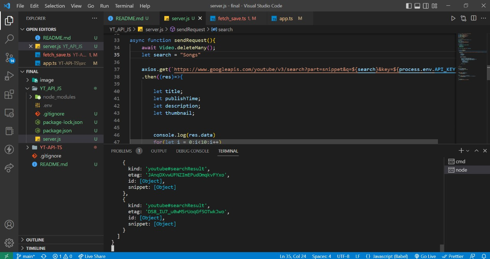
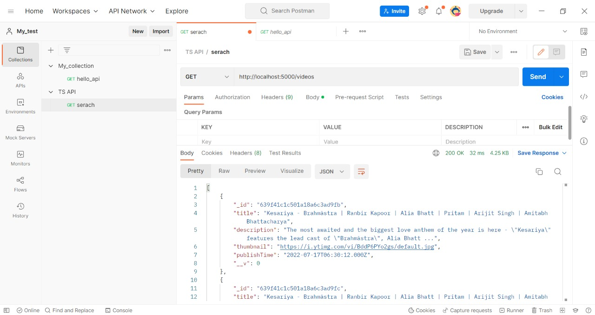

# Youtube API

To make an API to fetch latest videos sorted in reverse chronological order of their publishing date-time from YouTube for a given tag/search query in a paginated response.


## Installation Instructions

- Clone this project :

```
https://github.com/harshit-paneri/Youtube-API.git
```
- Change Directory 
  ```
  cd YT-API-JS/YT-API-TS
  ```
- Install Node Packages   
  ```
  npm i
  ```
 #### Enabling YouTube Data API V3:
 - Collect you Youtube API v3 from Google Cloud Console.
 - you can also visit this link: https://console.cloud.google.com/apis/library/youtube.googleapis.com.
 
 #### Connecting to MongoDB Atlas:
 - Create a MongoDB Atlas cluster
 - Choose **Connect your application**

## The .env File

In ``YT-API-JS``, create dotenv (.env) file and install the npm packages ``npm i dotenv``


## Test the API

### 1. Testing YT_API_JS

Create a GET request to the following url:
```
http://localhost:5000
```
### 1. Testing YT_API_TS

Create a GET request to the following url:
```
http://localhost:4000
```

## Images


- VS CODE
you can change variable ``Search="<Type your String>"``.


- Postman Result
This is the postman result you can try with link :
```
http://localhost:5000/videos
```



- VS CODE
you can change variable ``Search="<Type your String>"``.



- Postman Result
This is the postman result you can try with link :
```
http://localhost:5000/videos
```
